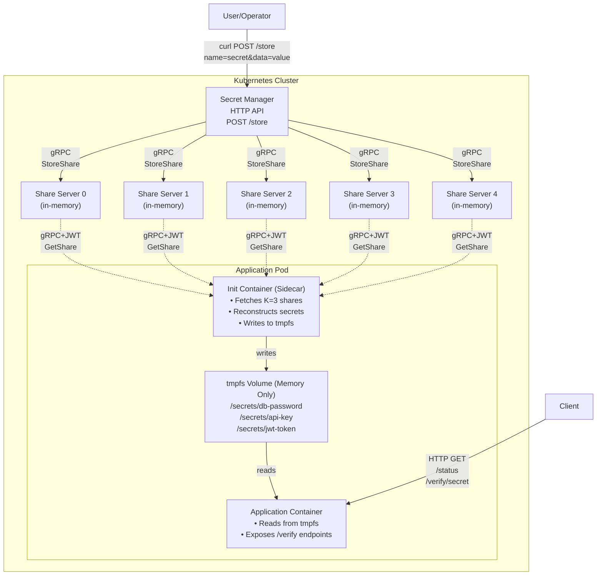

# 🐆 Hyena-K8s

**Decentralized Runtime Secret Management in Kubernetes Using Threshold Cryptography**

> ⚠️ **PROOF OF CONCEPT** - This is a research prototype demonstrating the feasibility of threshold cryptography for Kubernetes secret management. It is **NOT** production-ready and should not be used for real workloads.

## Overview

Hyena-K8s demonstrates a novel approach to secret management in Kubernetes using Shamir's Secret Sharing (SSS). Similar to HashiCorp Vault, the system follows a dynamic architecture:

1. **Deploy** infrastructure (share servers + secret manager) first
2. **Store** secrets via HTTP API - automatically split into N shares using threshold cryptography (K-of-N)
3. **Distribute** shares across multiple independent share servers in-memory
4. **Reconstruct** at runtime in pod init containers (requires K shares)
5. **Inject** into application containers via tmpfs (memory-only) volumes

**Key Property**: The plaintext secret never exists on disk and is only reconstructed when needed with K or more shares. Shares are stored in-memory only.

## Architecture



**Flow:**

1. 📥 **Store Secret**: User POSTs secret to Secret Manager → splits into N=5 shares → distributes to all share servers
2. 🔐 **Runtime Fetch**: Init container fetches K=3 shares via gRPC+JWT → reconstructs secret → writes to tmpfs
3. ✅ **App Access**: Application reads secrets from tmpfs → exposes verification endpoints
4. 🔍 **Verify**: Client can verify reconstruction correctness via SHA256 hashes

## Features

- ✅ **Shamir's Secret Sharing** - Threshold cryptography (K-of-N)
- ✅ **Distributed Storage** - No single point of failure
- ✅ **Dynamic Architecture** - Store secrets after deployment (like Vault)
- ✅ **In-Memory Storage** - Shares stored in RAM, never on disk
- ✅ **Multi-Secret Support** - Handle multiple secrets per application
- ✅ **Runtime Reconstruction** - Secrets only exist in memory
- ✅ **SHA256 Verification** - Cryptographic proof of correct reconstruction
- ✅ **JWT Authentication** - Kubernetes ServiceAccount tokens for GetShare (PoC: admin methods unauthenticated)
- ✅ **gRPC Communication** - Efficient, type-safe protocol
- ✅ **Tmpfs Volumes** - Secrets never touch disk
- ✅ **Helm Deployment** - Easy installation

## Quick Start

👉 **See [QUICKSTART.md](QUICKSTART.md) for a detailed step-by-step guide to deploy and test on a fresh minikube cluster.**

### Prerequisites

- Go 1.25+
- Docker
- Minikube
- kubectl
- Helm 3

### Basic Steps

```bash
# 1. Start minikube
minikube start

# 2. Build Docker images
eval $(minikube docker-env)
make docker-build

# 3. Deploy with Helm
helm install hyena ./charts/hyena

# 4. Store secrets via API
SECRET_MANAGER_URL=$(minikube service hyena-secret-manager --url | head -1)
curl -X POST "$SECRET_MANAGER_URL/store" -d "name=my-secret&data=my-secret-value"

# 5. Access demo app
minikube service hyena-demo-app
```

For complete instructions, see [QUICKSTART.md](QUICKSTART.md).

## Components

### Secret Manager

- **Purpose**: HTTP API to store, list, and delete secrets
- **Operations**: Splits secrets using Shamir's Secret Sharing and distributes to share servers
- **Protocol**: HTTP REST API + gRPC to share servers
- **Endpoints**:
  - `POST /store` - Store a new secret (splits and distributes)
  - `GET /health` - Health check
- **Deployment**: Deployment with NodePort service

### Share Server

- **Purpose**: Stores and serves SSS shares in-memory
- **Storage**: In-memory map (never persists to disk)
- **Authentication**: Validates JWT tokens from ServiceAccounts
- **Protocol**: gRPC with TLS support (optional)
- **Admin Methods**: StoreShare, DeleteShare (no auth required in PoC)
- **Deployment**: StatefulSet with N replicas

### Sidecar Reconstructor (Init Container)

- **Purpose**: Fetches shares and reconstructs multiple secrets
- **Behavior**: Runs once at pod startup
- **Multi-Secret**: Supports fetching multiple secrets via SECRETS env var
- **Failure**: Pod fails if < K shares available for any secret
- **Output**: Writes secrets to separate files in tmpfs volume

### Demo Application

- **Purpose**: Demonstrates secret consumption and verification
- **Endpoints**:
  - `GET /` - Web UI showing status
  - `GET /health` - Health check
  - `GET /status` - JSON status with SHA256 hashes
  - `GET /secrets` - List all secret names
  - `GET /secret/<name>` - Get specific secret info
  - `GET /verify/<name>` - Get SHA256 hash for verification
- **Security**: Never logs or displays secret values (only hashes)

## Configuration

### Helm Values

```yaml
shareServer:
  replicaCount: 5 # N (total shares)
  threshold: 3 # K (minimum shares needed)
  devMode: true # Skip JWT signature verification

secretManager:
  enabled: true
  defaultN: 5 # Default number of shares
  defaultK: 3 # Default threshold

sidecar:
  timeout: "10s"
  maxRetries: 3

demoApp:
  enabled: true
  secrets: "db-password,api-key,jwt-token" # Comma-separated list
  serviceAccount:
    create: true
```

See [charts/hyena/values.yaml](charts/hyena/values.yaml) for full configuration.

## Development

### Build Binaries

```bash
make build
```

### Generate Protocol Buffers

```bash
make proto
```

### Run Tests

```bash
make test
```

### Clean Build Artifacts

```bash
make clean
```

## Documentation

- [Architecture](docs/architecture.md) - Detailed design and data flow
- [Threat Model](docs/threat-model.md) - Security analysis and limitations
- [Demo Walkthrough](docs/demo.md) - Step-by-step demo guide
- [Helm Chart](charts/hyena/README.md) - Chart documentation

## Project Structure

```
hyena-k8s/
├── cmd/
│   ├── share-server/        # Share server binary
│   ├── sidecar/             # Init container binary
│   ├── secret-manager/      # Secret manager HTTP API
│   ├── split-secret/        # Secret splitting tool (legacy)
│   └── hash-secret/         # SHA256 verification tool
├── pkg/
│   ├── shamir/              # Shamir's Secret Sharing (MPL-2.0)
│   ├── auth/                # JWT validation
│   ├── transport/           # gRPC + TLS
│   ├── config/              # Configuration
│   └── client/              # Share fetcher
├── proto/
│   ├── shareservice/        # Share server gRPC
│   └── secretmanager/       # Secret manager gRPC
├── charts/hyena/            # Helm chart
├── examples/demo-app/       # Demo application
├── scripts/                 # Helper scripts
└── docs/                    # Documentation
```

## How It Works

### 1. Deploy Infrastructure

```bash
helm install hyena ./charts/hyena
```

This deploys:

- 5 share servers (empty, waiting for shares)
- 1 secret manager (HTTP API)
- 1 demo app (will fail until secrets are stored)

### 2. Store Secrets (Dynamic)

```bash
# Get secret manager URL
SECRET_MANAGER_URL=$(minikube service hyena-secret-manager --url | head -1)

# Store secrets via HTTP API
curl -X POST "$SECRET_MANAGER_URL/store" \
  -d "name=db-password&data=my-secret-database-password"

curl -X POST "$SECRET_MANAGER_URL/store" \
  -d "name=api-key&data=my-api-key-12345"
```

The secret manager automatically:

- Splits the secret into N=5 shares using Shamir's Secret Sharing
- Distributes shares to all 5 share servers via gRPC
- Stores shares in-memory only (never on disk)

### 3. Runtime Reconstruction (Pod Startup)

When a pod with the sidecar starts:

1. Init container reads SECRETS env var (e.g., "db-password,api-key")
2. For each secret:
   - Reads ServiceAccount JWT token
   - Connects to share servers via gRPC
   - Fetches shares in parallel (with retries)
   - Reconstructs secret using `shamir.Combine()`
   - Writes to tmpfs at `/secrets/<secret-name>`
3. Exits successfully (or fails if < K shares available)

### 4. Application Access & Verification

Application container reads secrets from tmpfs volume:

```bash
# Access secrets
cat /secrets/db-password
cat /secrets/api-key

# Verify reconstruction was correct
curl http://demo-app/verify/db-password
# Returns: {"sha256": "80b5988a...", "length": 39, ...}

# Compare with original
hash-secret "my-secret-database-password"
# Returns same SHA256 hash - proves correctness!
```

## Security Considerations

### Trust Assumptions

- **Kubernetes API**: Trusted to validate ServiceAccount tokens
- **Network**: Share server communication protected by network policies
- **Memory**: Secrets in tmpfs are protected by Linux kernel isolation
- **Share Servers**: Each server is trusted to store its share correctly

### Threat Model

See [docs/threat-model.md](docs/threat-model.md) for detailed analysis.

**Key Threats NOT Addressed** (by design scope):

- Memory dumps or kernel exploits
- Compromised share server code
- Side-channel attacks
- Long-term key storage

## Limitations

This is a **proof of concept**, not a production system. Missing features:

- ❌ Secret rotation
- ❌ Audit logging
- ❌ Key versioning
- ❌ HA guarantees
- ❌ Performance optimization
- ❌ Formal security audit
- ❌ Production-grade error handling
- ❌ **Authentication for admin operations** (StoreShare/DeleteShare skip auth in PoC)

## Comparison with Existing Solutions

| Feature                | Hyena-K8s | Vault | Sealed Secrets |
| ---------------------- | --------- | ----- | -------------- |
| Centralized Store      | ❌        | ✅    | ✅             |
| Threshold Crypto       | ✅        | ❌    | ❌             |
| Runtime Reconstruction | ✅        | ❌    | ❌             |
| Disk-less Secrets      | ✅        | ❌    | ❌             |
| Production Ready       | ❌        | ✅    | ✅             |

## Contributing

This is a research project. Contributions should focus on:

- Bug fixes
- Documentation improvements
- Test coverage
- Demo enhancements

Please maintain the project scope - this is a PoC, not a production system.

## License

MIT License - Copyright (c) 2026 Randil Tharusha Withanage

See [LICENSE](LICENSE) file for details.

### Third-Party Components

This project incorporates code from HashiCorp Vault's Shamir Secret Sharing implementation:

- **File**: `pkg/shamir/shamir.go`
- **Original**: https://github.com/hashicorp/vault/blob/main/shamir/shamir.go
- **Copyright**: HashiCorp, Inc.
- **License**: Mozilla Public License 2.0 (MPL-2.0)

The MPL-2.0 is a file-level copyleft license, meaning only the specific file `pkg/shamir/shamir.go` must remain under MPL-2.0. The rest of this project is licensed under MIT.

See https://www.mozilla.org/en-US/MPL/2.0/ for full MPL-2.0 license text.

## Acknowledgments

- **Shamir's Secret Sharing**: Adi Shamir (1979)
- **HashiCorp Vault**: For the excellent SSS implementation
- **Kubernetes Community**: For the amazing platform

## Disclaimer

**This is NOT production-ready software.**

Do not use this for:

- Production workloads
- Sensitive data
- Compliance requirements
- Mission-critical systems

This project exists solely to demonstrate the feasibility of threshold cryptography for Kubernetes secret management.

## Contact

For questions or feedback about this research project, please open an issue.

---

**Remember**: This is a proof of concept. Use production-grade solutions like HashiCorp Vault for real workloads.
